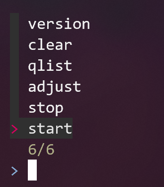

# timelog

[](https://github.com/qbart/timelog/blob/master/LICENSE)
[](https://golang.org/)
[](https://goreportcard.com/report/github.com/qbart/timelog)
[](https://github.com/qbart/timelog/commits/master)


```
Time logging in CLI

Usage:
  timelog [flags]
  timelog [command]

Available Commands:
  adjust       Adjusts time between entries
  archive      Archive data file
  autocomplete Autocomplete for entries
  clear        Clears all entries
  help         Help about any command
  polybar      Polybar configuration
  qlist        Prints all quicklist entries
  start        Starts a new time entry
  stop         Stops active time entry
  version      Prints software version

Flags:
  -h, --help   help for timelog

Use "timelog [command] --help" for more information about a command.
```

## Install

```
git clone git@github.com:qbart/timelog.git
cd timelog
make build
```

## Usage

### Print current timelog

```
timelog
```


### Start next task

```
timelog start <comment>
```

### Stop current task

```
timelog stop
```

### Clear

```
timelog clear
```

1. Current timelog will be printed.
2. Once confirmed local database will be cleared :warning:.

### Adjust time

```
timelog adjust
```

1. Console UI will start (use arrows or hjkl).
2. Enter to continue.
3. After changes you will see git-like diff to accept/reject changes.


### Archive

```
timelog archive
```

1. Current timelog will be printed.
2. Once confirmed file will be moved to archive (`~/.config/timelog/archive/`)

## Configuration

### Install autocompleter (bash + fzf using complete)

Tested only in Ubuntu (PR appreciated for other OSes)
```
timelog autocomplete install >> ~/.bash_profile
```

```
timelog [hit TAB]
```


### Quicklist

Quicklist is a data source for autocompleter (fzf). Tasks should not contain whitespaces.

```
vim ~/.config/timelog/config.ini
```

```
[quicklist]
task-1
task-2
task-3
hello
```

```
task start [hit TAB]
```


## Polybar (or any other bar) integration

You can integrate timelog with your custom bar:
```
timelog polybar format "FORMAT"
```

`FORMAT` exposes following vars in `go` template:
```go
type polybarItem struct {
	Comment         string // task comment
	Duration        string // last task duration
	Total           string // tasks total duration
	Count           int    // task count
	CountNotZero    bool   //
	TotalGtDuration bool   // true when total > duration
}
```

### Polybar example

```
[module/timelog]
type=custom/script
interval=10
exec=timelog polybar format "{{if .CountNotZero }}%{F#011814}%{B#24f5bf} {{.Comment}} %{B-}%{B#0adba6} {{.Duration}} %{B-}{{ if .TotalGtDuration}}%{B#08aa81} {{.Total}} %{B-}{{ end }}%{F-}{{ end }}"
```

#### When duration equals total

#### When duration does not equal total


## Config

## How to contribute?

Ask first before any implementation.
Possible todos:
- edit comments `timelog edit` (similar to `timelog adjust` editor)
- quicklist management from CLI ie. `timelog qlist.add ENTRY`
- multi-autocomplete i.e `timelog start [TAB]`, then `timelog start autocompleted-1 [TAB]` <- currently this will replace `autocompleted-1` with new qlist entry, goal is to append next one
- autocomplete for other OSes (OSx integration anyone?)
